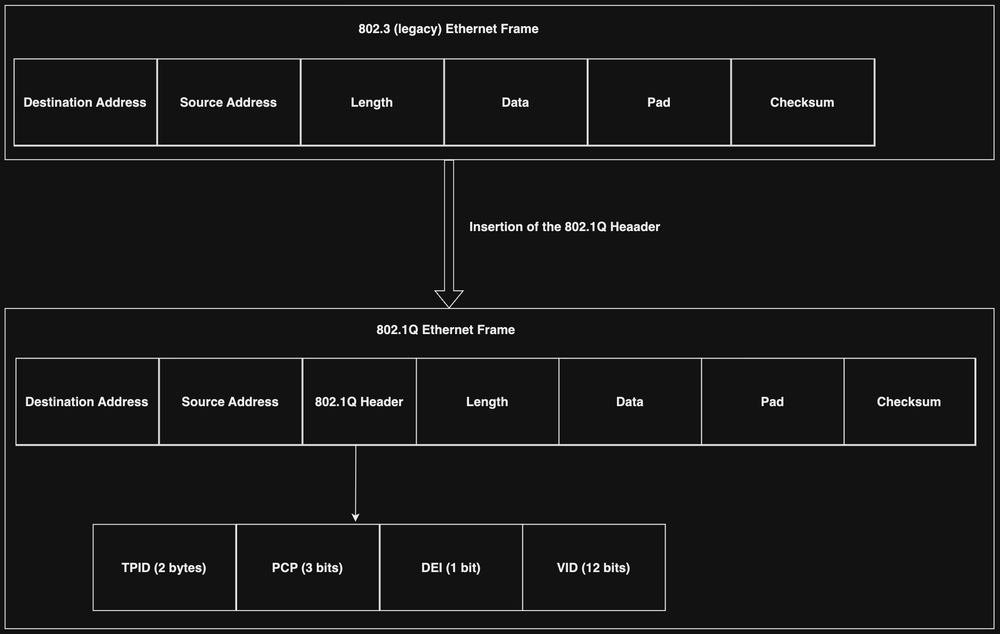

# Venders

## Cisco IOS Features
- Support for IPv6
- Quality of Service (QoS)
- Security features such as encryption and authentication
- Virtualization features such as Virtual Private LAN Service (VPLS)
- Virtual Routing and Forwarding (VRF)
- devices can be configured for SSH or Telnet

### Cisco Discovery Protocol (CDP)
- a layer-2 network protocol from Cisco
- used by Cisco devices such as the following to gather information about other directly connected Cisco devices:
    - Routers
    - switches
    - bridges
- This information can be used to:
    - discover and track the network's topology
    - help manage and troubleshoot the network

## Virtual Local Area Networks (VLANs)
- a logical grouping of network endpoints connected to defined ports on a switch
- Allows for the segmentation of networks by creating logical broadcast domains that can span multiple physical LAN segments
- each VLAN is
    - regarded as a broadcast domain
    - needs to its own subnet
- network administrators can segment networks based on the following Without worrying about the physical location of endpoints:
    - team
    - function
    - department
    - application

### VLAN Benefits
- **Better Organization**: Network administrators can group endpoints based on any common attribute they share.
- **Increased Security**: Network segmentation disallows unauthorized members from sniffing network packets in other VLANs.
- **Simplified Administration**: Network administrators do not have to worry about the physical locations of an endpoint.
- **Increased Performance**: With reduced broadcast traffic for all endpoints, more bandwidth is made available for use by the network.

### VLAN Memberships
- Network administrators can assign the ports of a switch to VLANs either statically or dynamically
- **Static VLAN assignment**: involves assigning each port to a VLAN manually using the switch's network operating system
    - which is the simplest and most common method
    - must be done for all switches separately
    - endpoints connecting to these ports are unaware of the existence of VLANs
    - a more secure option
        - The port is forever be tied to a specific VLAN ID, unless changed manually afterward.
- **Dynamic VLAN assignment**: automatically determines an endpoint's VLAN membership based on MAC addresses or protocols
    - increase administrative overhead
    - an attacker could potentially spoof the MAC address of legitimate endpoints and attain membership of their VLANs utilizing tools such as **macchanger**
        - This allows them to sniff all network traffic sent through the MAC addresses.
- **VLAN Membership Policy Server (VMPS)**: a centralized VLAN management service/database where the system administrator can register the MAC addresses

### VLAN Enables Switches
- are either on an **access port** or a **trunk port**
- **Access ports**: belong to and can carry the traffic of only one VLAN (or in some cases two, with the second being for voice traffic)
    - any traffic arriving here is assumed to belong to the VLAN the port was assigned
- **Trunk ports**: can carry multiple VLANs at the same time
    - **trunk links**: connect two trunk ports on two switches (or a switch and router)
        - allow information from multiple VLANs to be carried out across switches.

### VLAN Identification
- Standard 802.3 Ethernet frames do not contain VLAN information
- **trunking methods**: provide a mechanism (**ISL** or **IEEE 802.1Q**) for switches and other VLAN-enabled devices to keep track of all the VLAN information associated with a packet while traversing VLAN-enabled devices

#### Inter-Switch Link (ISL)
- Cisco-proprietary protocol used for trunking between VLAN-enabled devices
- one of the first trunking methods
- Currently, deprecated and not as widely used in modern Cisco switches
- most devices only support 802.1Q. ISL which has a 26-byte header and 4-byte trailer.

#### IEEE 802.1Q
- Developed by **Institute of Electrical and Electronics Engineers (IEEE)** in 1998
- Changed the 802.3 Ethernet frame format by adding a pair of 2-byte fields, TPID and TCI
- can contain information for 4094 VLANs



- **Tag protocol identifier (TPID)**: used to identify the Ethernet frame as an 802.1Q-tagged frame
    - a 16-bit field always set to 0x8100
- **Tag Control Information (TCI)**: is a 16-bit field
    - contains:
        - **Priority code point (PCP)**
        - **Drop eligible indicator (DEI)** (previously known as **Canonical format indicator (CFI)**)
        - **VLAN identifier (VID)**: main field concerning VLANs
            - occupies the low-order 12-bits of **TCI**
- **Double Tagging**: the practice of inserting multiple 802.1Q tags within a single packet
- **VLAN tagging**: the process of inserting VLAN information into an 802.1Q Ethernet header
- **VLAN untagging**: the process of removing the VLAN information from an 802.1Q-tagged Ethernet frame and forwarding the packet to the destined ports.

### Assigning NICs a VLAN in Linux
1. Create a parent interface (an interface on top of another)
    - This VLAN interface will tag packets with the assigned VLAN ID while returning packets will be untagged.
2. Ensure that the Kernel has the 802.1Q module loaded
    ```bash
    sudo modprobe 8021q
    lsmod | grep 8021  # makes sure 8021q was loaded successfully
    ```
3. Find the name of the physical Ethernet interface that we will create the VLAN interface on top of, which is eth0
    `ip a`
3. Assign a network adapter
    -  Tools to achieve this:
        - ip
        - nmcli
        - vconfig (deprecated)
    - Use **ip** to create a new interface that is a member of the desired VLAN, 20
        `sudo ip link add link eth0 name eth0.20 type vlan id 20`

4. Create the new interface
    `ip a`

5. Assign the interface an IP address and then start it
    - `sudo ip addr add 192.168.1.1/24 dev eth0.20`
    - `sudo ip link set up eth0.20`

6. Check whether the interface has changed states to up
    - `ip a | grep eth0.20`

### Analyzing VLAN Tagged Traffic (Example: analyzing a network packet dump)
1. Use **Wireshark** using the vlan filter
2. Inspect packets with **802.1Q** tagging using the ***vlan*** filter
3. Search for packets with a specific VLAN ID
4. Utilize tshark to enumerate the used VLAN IDs from a packet dump

### Security Implications and VLAN Attacks
- **VLAN Hoping**: enable traffic from one VLAN to be seen by another VLAN without the aid of a router
    - Exploits Cisco's **Dynamic Trunking Protocol (DTP)**: a protocol used to automatically negotiate the formation of a trunk link between two Cisco devices.
    - An adversary configures a host to mimic/act like a switch to take advantage of the automatic trunking port feature enabled by default on most switch ports
        - They must be able to physically connect with a switch port that has DTP enabled
        - If successful, the switch will eventually establish a trunk link with the adversary's host, exposing the network packets, not only for a specific VLAN
        - **Tool**:  Yersinia
- **Double-tagging VLAN Hopping**: an adversary embeds a hidden 802.1Q tag inside an Ethernet frame that already has an 802.1Q tag
    - This allows the frame to go to a different VLAN, which the original 802.1Q tag did not specify
    - Only works if the adversary is connected to a port residing in the same VLAN as the native VLAN of the trunk por
    1. The adversary sends a double-tagged 802.1Q Ethernet frame to the switch with the outer header having the VLAN ID of the adversary
    2. The outer 4-byte 802.1Q tag arrives on the switch, and it is seen to be destined for VLAN 10, the native VLAN
        - After removing the VLAN 10 tag, the frame is forwarded on all VLAN 10 ports
        - On the trunk port, the VLAN 10 tag is stripped (removed), and the packet is not re-tagged because it is part of the native VLAN
        - However, the VLAN 30 tag is still intact (not stripped), and the first switch has not inspected it.
    3. the switch will look only at the inner 802.1Q tag that the adversary sent
        - it decides that the frame must be forwarded for VLAN 30, which is the adversary's chosen VLAN
        - the second switch will either send the frame to the victim port directly or flood it
            - This depends on whether there is an existing MAC address table entry for the victim host.
    - **Tools**:
        - Scrappy
        - Yersinia
- **VXLAN**: 
    - current Layer 2 networks utilize the IEEE 802.1D (STP) to prevent network loops caused by redundant paths
        - **Spanning Tree Protocol (STP)**: a network protocol that ensures no loops in a network with multiple connections between switches.
            - it prevents data packets from circulating in a loop and congesting the network
    - **limitations of STP**: link blocking, which reduces available ports and prevents resiliency through multipathing
    -  hinder network efficiency in virtualized environments that rely on Layer 2 physical infrastructure.
    - **critical requirement**: the seamless scalability of the Layer 2 network across the entire data center and even between data centers to allocate computing, networking, and storage resources efficiently
    - **The Solution for Layer 2 Networks** RFC7348 introduces VXLAN
        - **Virtual eXtensible Local Area Network (VXLAN)**: a Layer 2 overlay scheme on a Layer 3 network.
        - seamlessly extends a Layer 2 network
        - facilitate the scaling of Layer 2 networks across expansive data center landscapes, even spanning multiple physical data locations.
        - ensures that only VMs within the same VXLAN segment can communicate with each other
        - maintains network isolation and security
        - **VXLAN Network Identifier (VNI)**: uniquely identifies each VXLAN segment
            - A 24-bit segment ID
        - allows for the coexistence of 16 million VXLAN segments within the same administrative domain
        - provides scalability and flexibility for modern data centers and virtualized environments